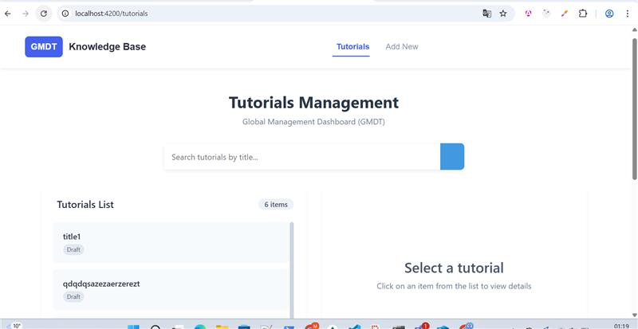
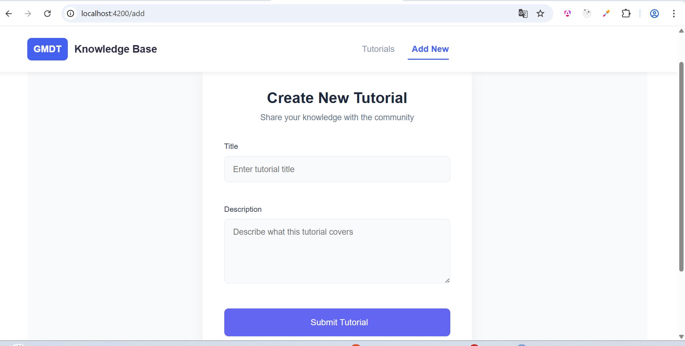
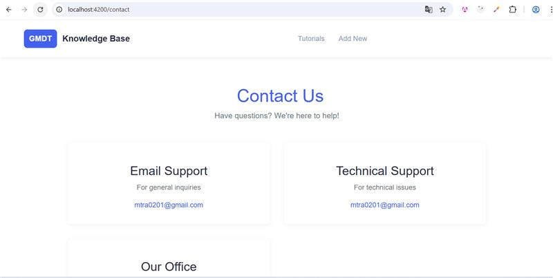

Here's a comprehensive `README.md` for your GMDT application with Angular and Spring Boot, including placeholder instructions for adding screenshots:

````markdown
# GMDT - Global Management Dashboard for Tutorials


A full-stack application for managing educational tutorials, built with Angular 17 and Spring Boot 3+.

## Features

- **CRUD Operations**: Create, Read, Update, Delete tutorials
- **Modern UI**: Clean, responsive interface with beautiful animations
- **Search Functionality**: Find tutorials by title
- **Status Management**: Mark tutorials as published/draft
- **RESTful API**: Robust backend service

## Screenshots

### Tutorials List Page



### Add Tutorial Form



### Contact Page



## Technology Stack

### Frontend

- Angular 17
- TypeScript
- RxJS
- Angular Material (optional)
- Font Awesome
- HTML5/CSS3

### Backend

- Spring Boot 3+
- Java 17+
- Spring Data JPA
- RESTful API
- MySQL/PostgreSQL/H2 (configurable)

## Prerequisites

- Node.js 16+ & npm 8+
- Angular CLI 17+
- Java JDK 17+
- Maven 3.6+
- MySQL 8+ (or preferred database)

## Installation

### Backend Setup

1. Clone the repository
2. Configure database in `application.properties`:
   ```properties
   spring.datasource.url=jdbc:mysql://localhost:3306/gmdt
   spring.datasource.username=root
   spring.datasource.password=yourpassword
   ```
````

3. Build and run:
   ```bash
   mvn clean install
   mvn spring-boot:run
   ```

### Frontend Setup

1. Navigate to frontend directory:
   ```bash
   cd frontend/
   ```
2. Install dependencies:
   ```bash
   npm install
   ```
3. Run development server:
   ```bash
   ng serve
   ```
4. Open `http://localhost:4200` in your browser

## API Endpoints

| Method | Endpoint                       | Description          |
| ------ | ------------------------------ | -------------------- |
| GET    | /api/tutorials                 | Get all tutorials    |
| GET    | /api/tutorials/:id             | Get tutorial by ID   |
| POST   | /api/tutorials                 | Create new tutorial  |
| PUT    | /api/tutorials/:id             | Update tutorial      |
| DELETE | /api/tutorials/:id             | Delete tutorial      |
| DELETE | /api/tutorials                 | Delete all tutorials |
| GET    | /api/tutorials?title=[keyword] | Search by title      |

## Project Structure

```
gmdt/
├── backend/               # Spring Boot application
│   ├── src/
│   │   ├── main/
│   │   │   ├── java/com/gmdt/
│   │   │   │   ├── controller/  # REST controllers
│   │   │   │   ├── model/       # Entity classes
│   │   │   │   ├── repository/  # JPA repositories
│   │   │   │   ├── service/     # Business logic
│   │   │   ├── resources/
│   │   │   │   ├── application.properties
│
├── frontend/              # Angular application
│   ├── src/
│   │   ├── app/
│   │   │   ├── components/      # Angular components
│   │   │   ├── services/        # API services
│   │   │   ├── models/          # TypeScript interfaces
│   │   ├── assets/              # Images, styles
│   │   ├── environments/        # Environment configs
```

## Development

### Running Tests

Backend:

```bash
mvn test
```

Frontend:

```bash
ng test
```

### Building for Production

Backend:

```bash
mvn clean package
```

Frontend:

```bash
ng build --prod
```

## Deployment

### Docker Setup

1. Build backend image:
   ```bash
   docker build -t gmdt-backend ./backend
   ```
2. Build frontend image:
   ```bash
   docker build -t gmdt-frontend ./frontend
   ```
3. Run with docker-compose:
   ```bash
   docker-compose up
   ```

## Contributing

1. Fork the project
2. Create your feature branch (`git checkout -b feature/AmazingFeature`)
3. Commit your changes (`git commit -m 'Add some AmazingFeature'`)
4. Push to the branch (`git push origin feature/AmazingFeature`)
5. Open a Pull Request

## License

Distributed under the MIT License. See `LICENSE` for more information.

## Contact

Project Link: [https://github.com/mtraore-selin/tuto-spring-h2-angular.git](https://github.com/mtraore-selin/tuto-spring-h2-angular.git)

````

## How to Add Actual Screenshots

1. Take screenshots of your running application
2. Save them in your project's `/documentation/images` folder
3. Replace the placeholder URLs with relative paths:
   ```markdown
   
   
   
````

This README includes:

- Project overview
- Visual representation
- Technology stack
- Installation instructions
- API documentation
- Project structure
- Development workflow
- Deployment options
- Contribution guidelines

You can customize any section to better match your specific implementation details.
